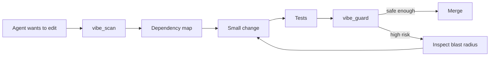

<p align="center">
  
</p>

<p align="center">
  <strong>Your AI writes fast. Vibe Surgeon keeps the repo safe to change.</strong>
</p>

<p align="center">
  
  
  
  
  
</p>

**Vibe Surgeon** is a local, vendor-neutral safety layer for repositories changed by AI coding agents. It works beside Claude Code, Codex, Cursor, OpenCode, Cline, Windsurf, or humans.

It does not try to write more code. It helps prevent fast AI-written code from quietly turning into a repository nobody understands.

```bash
npx -y vibe-surgeon@latest all .
```

No API key. No account. **Zero runtime dependencies.**

---

## The problem

AI coding changed the bottleneck.

The hard part is no longer producing a patch. The hard part is knowing whether that patch touched a hotspot, expanded blast radius, introduced repository risk, or made the next AI session more confused than the previous one.

Vibe Surgeon gives coding agents a small, repeatable safety loop:



## 30-second workflow

```bash
# 1. Create local safety metadata
vibe-surgeon init .

# 2. Understand the repository
vibe-surgeon scan .
vibe-surgeon map .

# 3. Give your coding agent compact context
vibe-surgeon context .

# 4. Save an accepted state
vibe-surgeon baseline .

# 5. After an AI-assisted change
vibe-surgeon guard . --base origin/main
vibe-surgeon compare .
```

Example terminal result:

```text
◆ VIBE SURGEON
  Repository safety for AI-written code

┌─ Vibe Health ─────────────────────────────────────────┐
│ ███████████████████░░░░░  82/100  WATCH              │
│ 143 source · 31 tests · 18,420 LOC                    │
│ Stack  Node.js · TypeScript · React                   │
└───────────────────────────────────────────────────────┘

Findings (2)
  MEDIUM   GIANT_FILES  3 source files exceed 800 LOC.
  LOW      TODO_LOAD    27 TODO/FIXME/HACK markers found.
```

## What it does

| Command | What you get |
|---|---|
| `scan` | Explainable **Vibe Health Score** and repository findings |
| `map` | Local dependency graph, hotspots, `ARCHITECTURE.md` |
| `guard` | Git-diff risk score and **blast radius** |
| `context` | Compact agent handoff instead of another full-repo dump |
| `doctor` | Prioritized `REPAIR_PLAN.md` |
| `baseline` | Save an accepted repository-health state |
| `compare` | Fail CI when health regresses from that baseline |
| `sarif` | SARIF 2.1.0 for GitHub code scanning |
| `report` | Standalone dark-mode HTML report for demos/reviews |
| `mcp` | Local MCP server exposing repository-safety tools |
| `all` | Bootstrap the core workflow in one command |

Generated local workspace:

```text
.vibe-surgeon/
├── ARCHITECTURE.md
├── CONSTITUTION.md
├── REPAIR_PLAN.md
├── baseline.json
├── config.json
├── context.md
├── map.json
├── report.html
└── results.sarif
```

## Visual report

Generate a standalone report with no web server:

```bash
vibe-surgeon report .
```

Open `.vibe-surgeon/report.html`. It contains the score, stack, findings, repository scale and dependency hotspots in a shareable dark-mode dashboard.

## MCP: let the agent call the safety layer itself

Run Vibe Surgeon as a local MCP server:

```bash
npx -y vibe-surgeon@latest mcp .
```

It exposes:

- `vibe_scan`
- `vibe_map`
- `vibe_guard`
- `vibe_context`
- `vibe_blast_radius`

Generic MCP configuration:

```json
{
  "mcpServers": {
    "vibe-surgeon": {
      "command": "npx",
      "args": ["-y", "vibe-surgeon@latest", "mcp", "."]
    }
  }
}
```

See [MCP integration](docs/mcp.md).

## GitHub pull-request guardrails

Generate SARIF locally:

```bash
vibe-surgeon sarif . --output vibe-surgeon.sarif
```

A ready workflow lives in [`templates/github/vibe-surgeon.yml`](templates/github/vibe-surgeon.yml). It scans the repository, guards pull-request blast radius, and uploads SARIF findings to GitHub code scanning when available.

See [GitHub integration](docs/github.md).

## Baseline instead of fake perfection

A legacy repository should not fail just because its starting score is 61/100. Save the accepted state once:

```bash
vibe-surgeon baseline .
```

Then prevent new AI-assisted changes from making it worse:

```bash
vibe-surgeon compare .
```

This turns the score into a **ratchet**: old debt is visible, new debt is blocked.

## Guard: know what a tiny edit can break

```bash
vibe-surgeon guard . --base origin/main
```

Risk increases when a change:

- touches top dependency hotspots;
- fans out into many dependent files;
- changes auth, security, billing, migrations, schemas or token/session code;
- changes CI or dependency lockfiles;
- exists in a repository with no detected tests;
- coexists with secret-like material.

`guard` exits non-zero for high-risk changes, making it suitable for CI.

## Why local-first

Core analysis is deterministic and runs locally. Source code is not uploaded to a hosted service by Vibe Surgeon.

That matters because repository structure, credentials, auth code and business logic are exactly the material a safety tool should avoid sending elsewhere by default.

## Supported today

The repository scanner recognizes common Node.js, React, Next.js, Vite, Python, Go, Rust, JVM and Docker project signals.

Dependency mapping currently resolves local JavaScript/TypeScript and Python imports. It intentionally does **not** pretend that regex-based static analysis understands every runtime dependency.

That limitation is part of the product philosophy: **explain risk; do not fake certainty.**

## Roadmap

- [x] Vibe Health Score
- [x] dependency hotspots and blast radius
- [x] compact agent context
- [x] baseline / regression gate
- [x] MCP server
- [x] SARIF / GitHub code scanning
- [ ] semantic symbol graph with tree-sitter
- [ ] test-impact selection
- [ ] framework rule packs
- [ ] PR bot with inline risk summary
- [ ] VS Code / Cursor extension
- [ ] optional LLM-assisted repair recipes
- [ ] public Vibe Health benchmark suite

## Design principles

1. **Local first.** Core workflow never requires uploading source.
2. **No token tax.** Static safety checks should not consume LLM tokens.
3. **Agent-neutral.** Sit below the model/vendor layer.
4. **Fast enough to become muscle memory.**
5. **Explain every warning.**
6. **Never market heuristics as formal verification.**

## Contributing

The best contribution is a real AI-coding failure mode reduced to a small reproducible repository. If Vibe Surgeon should have warned you and did not, open a `failure-mode` issue.

See [CONTRIBUTING.md](CONTRIBUTING.md).

## Security

Vibe Surgeon can detect secret-like strings, but it is not a replacement for a dedicated secret scanner or security review. If a real credential was committed, rotate it; deleting the current file is not enough.

See [SECURITY.md](SECURITY.md).

## License

MIT
