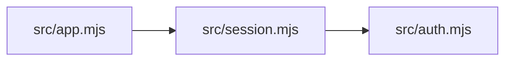

# Reproduce the first-run demo

This is a **synthetic fixture**, deliberately small enough to inspect. It is not
an adoption metric, a customer incident, or a benchmark of detection quality.

```bash
npm run demo
```

The [script](../scripts/demo.mjs) creates a temporary Git repository with:



It commits the baseline, changes `sessionMinutes` from 30 to 60 in `src/auth.mjs`,
then runs `guard --base HEAD`. The real result is:

```text
VIBE SURGEON — REPRODUCIBLE DEMO
Synthetic fixture; not a customer case or a real-world benchmark.

Change: src/auth.mjs (session duration: 30 -> 60)
Mapped: 3 source files, 2 local import edges
Changed files: 1
Potentially impacted files: 3 (includes the changed file)
  src/auth.mjs
  src/session.mjs
  src/app.mjs
Heuristic change risk: 55/100 (high)
  + a top dependency hotspot changed
  + changes exist but no tests were detected
  + security/business-critical area changed
Guard CLI exit: 2 (review required)

This does NOT prove that behavior broke. No application tests are run.
The warning comes from local imports, filename rules and missing test files.
```

## Why 55?

The existing rules add 20 for a top dependency hotspot, 20 for changed files with
no detected tests, and 15 for a configured critical filename. These weights are
heuristics, not measured probabilities of a bug. Impact includes the changed
file plus two files found by following reverse import edges to depth two.

The script asserts the changed file, impacted file set, risk and CLI exit code.
A mismatch fails the demo. The temporary repository is removed in `finally`.

Open `.vibe-surgeon/demo/report.html` for the **separate repository-health report**.
Its health score is not the change-risk score above. `evidence.json` records the
change-risk output, and `transcript.txt` is ready to inspect or share.
Use `npm run demo -- --output /chosen/directory` to choose the artifact directory.

## What would make this stronger?

Real public-repository fixtures, known expected import edges, and measured misses
and false positives. Those results are not available yet. A behavioral regression
test would be separate evidence; this demo does not provide it.
